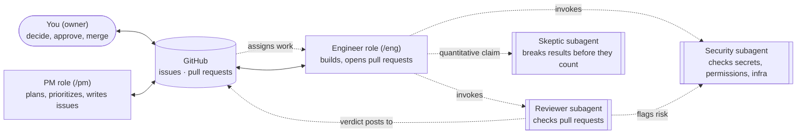

# Trazo

**A governance overlay for AI coding agents. Mount it on any repo — new or existing — and agents start working to rules instead of improvising.**

Trazo ships tested adapters for **Claude Code** and **OpenAI Codex**, plus a generic `AGENTS.md` adapter for other agents that read it. It is opinionated about how agents hand work to each other and how they check results, while staying neutral about your language, framework, and where your code runs.

[:material-download: Install](install.md){ .md-button .md-button--primary }
[:material-book-open-page-variant: Read the playbook](playbook.md){ .md-button }
[:material-layers-triple: What is `.trazo/`?](overlay.md){ .md-button }

---

## The problem

Almost every serious repo already exists, with its own runtime, toolchain and pipeline. Point a coding agent at it and the same things happen again and again:

- **Agents forget.** Sessions end, contexts reset, and plans or decisions kept only in chat are lost.
- **Copy-paste glue.** Moving notes between an "advisor" chat and a coding agent by hand loses information.
- **Secrets leak easily.** Keys end up in `.env` files, logs, commits, or chat.
- **No project management.** No charter, no milestones, no record of *why* something was decided.
- **Results look better than they are.** Agents grade work against their own assumptions instead of reality.
- **Safety limits drift.** An agent "helpfully" loosens a threshold nobody approved.

A starter template only fixes these for a new repo, and most projects already have a codebase. Trazo mounts into an existing repo instead.

Trazo's answer: **the repo is the memory, and the rails are mounted rather than imposed.** It adds a pinned `.trazo/` overlay and the adapter for your agent. Your code, build, and deploy setup stay yours.

## What it adds

Two layers, and the second is the one that matters.

**The mechanical rails** — table stakes, and easy to copy:

- worktree isolation per change, so two agents never fight over a dirty tree
- role separation, so an agent never grades its own work
- GitHub as the state engine — issues, pull requests, labels — not a database
- secrets discipline: nothing secret is ever read, printed or committed by an agent

**The judgment layer** — the reason to keep going:

- a **charter** with a goal, a budget, success criteria, and a **stop rule** written *before* the results exist
- **evidence with sample sizes**, judged against external ground truth, never against the agent's own model
- a **skeptic** that tries to break every quantitative result before it is acted on

That last pair is the differentiator, and it is the part a spec-and-ADR folder leaves out. Agents remove attrition as a stop mechanism: continuing a doomed project is nearly free and produces plausible commits throughout. Without a charter and a stop rule written down in advance, nothing ever decides to quit.

## How it works

A small team, talking to each other through GitHub — never through chat memory that can vanish with a closed window.



The PM writes issues, the engineer turns them into pull requests, and you approve and merge. Claude Code uses Haiku for engineering command turns and pins PM, reviewer, security, and skeptic subagents to Sonnet. Codex pins engineer agents to Luna and its other role agents to Sol. Users of other compatible agents choose their provider and model. Claude role-command model overrides last for one turn; see [the team](team.md) and [playbook](playbook.md) for details.

## Mounting it

Trazo is an overlay, so you do not have to start from an empty repo. From the root of any git repository, new or existing, run the installer:

```bash
curl -fsSL https://raw.githubusercontent.com/manoochehri/trazo/v0.1.0/scripts/install.sh -o install.sh
bash install.sh install v0.1.0
```

It copies the framework into `.trazo/`, adds the adapter for the agent you use (`CLAUDE.md` and `.claude/` for Claude Code, `AGENTS.md` for others; [the same `.trazo/rules.md` drives any of them](overlay.md)), and creates `.trazo/project/` for your own state. An existing `AGENTS.md`, `CLAUDE.md` or `.claude/` stays yours: the installer only writes between its own markers. See [Install, upgrade and uninstall](install.md) for options, and [`AGENTS.md` and Trazo](agents.md) for how the two files relate. Your runtime, your build system and your pipeline stay exactly as they are; Trazo mandates no tool for a mounted repo, on purpose.

After installing the adapter, start a fresh agent session and use its kickoff workflow (`/kickoff` in Claude Code or `$trazo-kickoff` in Codex). It interviews you, presents the charter and plan for approval, then helps set up GitHub labels, milestones, and issues. The installer and kickoff do not add CI, a Dockerfile, or CODEOWNERS; those stay yours.

## A normal day

```
you + PM (/pm)  →  issues  →  engineer (/eng)  →  pull request  →  reviewer + CI  →  you merge
```

Ten to fifteen minutes of your attention: a morning briefing, a decision or two, a merge or two, and a one-line "wrap up" at the end. The [playbook](playbook.md) walks through the whole loop and has an FAQ for everything in between.

## Layout and releases

`v0.1.0` is the first published release. Its source lives under `src/`; `.trazo/` is this repository's pinned install. A host receives the framework and blank project templates, then keeps its own charter, decisions, and status under `.trazo/project/`. A release is tracked by a GitHub milestone and published as an immutable tag. See [What is `.trazo/`](overlay.md) and the [changelog](changelog.md).

## Lessons learned

The first release clarified a few habits that make the framework easier to use. See the short [v0.1.0 lessons learned](lessons.md) list.

## Deploying

**Trazo ships no deploy target.** The overlay governs how agents work; your build and your cloud are yours. If you are mounting Trazo onto an existing repo, deployment is somebody else's decision and Trazo stays out of it.

See the [guide](guide.md) for the full setup walkthrough, including the optional GitHub Actions automation.
