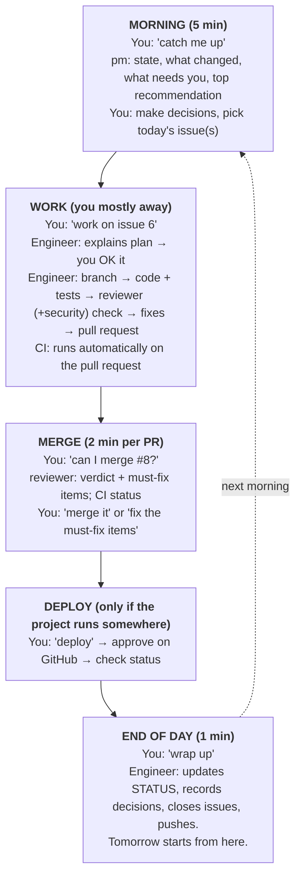

# Trazo playbook

How a Trazo project actually runs: the daily loop, who does what, and what to do in every common situation.
For setup and reference, see the [guide](guide.md).

---

## The team

| Who | Command | Does | Model | Edits code? |
|---|---|---|---|---|
| **You (owner)** | – | Decide, approve, merge. Pick what matters; answer what only you can. | – | Rarely |
| **Engineer** (your main Claude Code session) | `/eng` | Builds: code, tests, branches, pull requests | Your choice | Yes |
| **PM / advisor** | `/pm` | Status, planning, priorities, "is this real?", writes issues | Opus (the `pm` subagent; `/pm` keeps your session model) | No |
| **Reviewer** | subagent only | Checks pull requests before merge, with fresh eyes | Opus | No |
| **Security** | subagent only | Checks anything touching secrets, permissions, workflows, infra | Opus | No |
| **CI** (GitHub Actions) | – | Runs tests, lint, secret scan, build on every pull request | – | No |

The four subagents are pinned to Opus. The main session runs on whatever model you picked with `/model`; role commands do not change it.

**How they talk:** through GitHub (issues, pull requests, comments) and the `.trazo/project/` folder. Not through chat memory. Any session can be closed and a fresh one picks up from the repo.

**You talk to all of them in one Claude Code window, in plain English.** Type `/pm` to switch into the PM role directly for the rest of the conversation; `/eng` takes you back to building. Reviewer and security are subagent-only — the engineer session invokes them, automatically as part of `/work` and `/check-pr`, or ad hoc. Commands are optional shortcuts (type `/trazo` for a menu).

---

## The game loop

**Your whole job:** decide, approve, merge. On a normal day, 10–15 minutes of attention.

---

## FAQ

### Starting and planning

**How do I start my day?**
Open VS Code in the project, start Claude Code, say *"catch me up."* The PM briefs you from the repo.

**I have an idea. What do I do?**
Say it: *"I want X. Is it worth it?"* (or switch to `/pm`). The PM thinks it through with you. If you agree to do it, say *"make that an issue."* Ideas that aren't issues get forgotten.

**How do I decide what to work on?**
Ask *"what should I work on next?"* The PM weighs the plan, milestones, and what's blocked. You pick.

**Something needs a decision only I can make. Where do I find those?**
Issues labeled `needs-decision`. The morning briefing lists them. Answer in the issue; the PM clears the label only after a comment quoting your words verbatim (typed by you in session, or posted by you on the issue), and a quote relayed by another agent does not count. Say *"record that decision"* so it becomes a decision record.

**I want a big-picture strategy conversation, not a quick answer.**
In Claude Code, type `/pm` to talk with the PM directly for the rest of the conversation. It switches the role, not the model, so run `/model opus` first if you want Opus for a long planning conversation. End with *"record what we decided."* When done planning, `/eng` switches back to the engineer.

### Doing the work

**How do I get something built?**
*"Work on issue 6."* The engineer explains its plan first; you say OK or adjust. Then it works on its own and opens a pull request.

**Do I have to watch it work?**
No. Approve the plan, then leave. It'll stop and ask if it hits something only you can answer.

**It's asking me to approve every command. Can I stop that?**
Yes, with Claude Code's permission settings, but keep approvals on for pushing, merging, deploying, and anything that spends money or touches secrets.

**Can two things happen at once?**
Talking and reviewing in parallel: yes, open another window. Two engineers editing code at once: only in separate git worktrees (under `.worktrees/` via `git worktree add`, or via `claude --worktree`), otherwise they collide. See `.trazo/project/RUNBOOK.md` for commands.

**It wrote something wrong / went in the wrong direction.**
Say so plainly: *"stop, that's not what I meant, I want X."* If it's already a pull request, say *"close PR #8"* and restate the issue.

### Reviewing and merging

**How does the skeptic work?**
Any number you're about to act on goes to the **skeptic** subagent first — a measured result, a benchmark, a cost or performance figure, an A/B or backtest outcome. It checks the result against the bar in `.trazo/project/SKEPTIC_BAR.md` (which you fill in for your domain at kickoff) and returns **holds / holds with caveats / does not hold**, with the three most serious problems, the evidence for each, and the check that would settle it. Until it clears, the result doesn't reach a decision, a decision record, a registry, or a status doc.

The point is that the agent which built an analysis is the worst-placed thing to review it: it knows what it meant to build, so it reads the output as if it meant what it meant. A second question in the *same* conversation doesn't help — that's why this is a separate subagent and never a mode you switch into. Run it every time, not just when a number looks odd; the failure it catches is the result that looks completely fine.

**How does the reviewer work?**
It's a separate reviewer subagent, fresh-context and never the conversation that wrote the code, so it isn't grading its own work. It reads the diff, the issue, the rules, and CI results, and returns: **merge / merge after fixes / don't merge**, with must-fix items by file and line, posted as a real `gh pr review`. It runs when the engineer finishes `/work`, or whenever you ask *"can I merge #8?"*.

**When is security involved?**
Automatically when a change touches secrets, permissions, `.github/workflows/`, or dependencies. Or ask anytime: *"is this secure?"* — the security subagent checks it (it's subagent-only, not a role you switch the session into).

**How do I merge?**
If the reviewer says merge and CI is green: *"merge it."* Or click **Merge** on the pull request in GitHub.

**CI failed (red X). Now what?**
Say *"CI failed on #8, fix it."* The engineer reads the failure log and fixes it. Nothing merges to `main` until it's green.

**Dependabot opened a bunch of pull requests.**
Normal: weekly version updates, grouped by type. Say *"handle the Dependabot PRs."* Green ones get merged; failures get explained.

### Deploying and rolling back

**How do I deploy?**
Merge to `main` first: that's "ready." Deploying is a separate step: say *"deploy."* With the GitHub deploy workflow, it pauses for your **Approve** click on GitHub. Every deploy uses an image tagged with its exact commit.

**How do I know what's running?**
*"What's deployed?"* The engineer runs the project's status command (see `.trazo/project/RUNBOOK.md`).

**A change broke something. How do I undo the code?**
*"Undo PR #8."* The engineer creates a revert pull request that exactly reverses it. CI runs, you merge. History keeps both, so you can redo it later.

**A deploy broke something. How do I roll back?**
*"Roll back to the previous version."* It redeploys the previous tag (with your approval if using the workflow). Then undo the code as above, so `main` matches what's running.

**What can't be rolled back?**
Anything that changed the outside world: data written or deleted, money moved or orders placed, messages sent, files published. Protection here is prevention (reviewer, security, your approval for risky actions) and backups, not rollback. Know where your backups are (`.trazo/project/RUNBOOK.md`).

### Money and safety

**How do I keep costs under control?**
Kickoff sets a budget alert with your cloud provider. Ask *"what are we spending?"* anytime. Before approving new cloud resources, ask for a per-resource price list: estimates often miss disks, public IPs, and storage.

**An agent wants to loosen a safety limit.**
Only you can, and CODEOWNERS requires your review. Ask for the evidence (with sample sizes) and a decision record first. Default answer: no.

**I think a secret leaked.**
Treat it as leaked: **rotate it immediately** (make a new key, delete the old one) in the provider's settings. Then *"check for leaked secrets"* (the security subagent runs a full-history scan and checks logs). Deleting a file doesn't remove it from git history; rotation is what actually protects you.

**Where do secrets go?**
Local: `.env` (git-ignored, blocked from Claude Code). Cloud: the provider's secret store, entered by you with a script or UI. Never in chat, code, logs, or issues.

**The results look amazing.**
Ask the PM (or type `/pm`) *"is this real?"* It checks: measured against external reality or the system's own assumptions? Enough samples? Tuned on the same data it's judged on?

### When things go sideways

**The AI forgot what we were doing.**
Start a fresh session and say *"catch me up."* That's what the docs are for. It happens; it's not a problem.

**The session got long and confused.**
Same: close it, start fresh. Long sessions degrade; the repo doesn't.

**"Safeguards flagged this message" errors.**
Sessions heavy on security topics (keys, permissions, network setup) can trip automatic filters by mistake. Start a fresh session.

**My cloud login expired.**
Run the login command again (e.g., `aws login --profile <name>`). Deploys through the GitHub workflow don't need it.

**A scheduled job or report didn't show up.**
Ask *"did last night's job run?"* A common cause: the job was installed after its scheduled time and hasn't hit its first run yet.

**I closed my laptop. Did anything stop?**
Claude Code sessions stop. Anything deployed (servers, containers, GitHub Actions) keeps running. Nothing is lost: *"catch me up"* when you're back.

**Can I check in from my phone?**
Yes: the GitHub app shows issues, pull requests, CI, and lets you comment, merge, and approve deploys. Building needs your laptop (or the optional GitHub automation in the guide).

### Bigger moments

**How do I start a brand-new project?**
From a Claude chat with the project-kickoff skill: *"let's kick off a new project."* Or install Trazo into a new repo (`bash install.sh install v0.1.0`, see [Install](install.md); no release exists yet, so this works once `v0.1.0` is cut, #100), open it in Claude Code, `/kickoff`.

**I already have a repo. Can I use Trazo on it?**
Yes — that is the main case. Declare a one-command hermetic build/test environment, run the installer (see [Install](install.md)), then `/kickoff`. Your runtime and pipeline stay as they are. See [What is `.trazo/`](overlay.md) and the guide's mounting option.

**The project's stop rule triggered.**
The PM will say so plainly. Decide: stop, pivot, or change the plan with a decision record explaining why. Stopping on schedule is a success, not a failure.

**The project is done. How do I shut it down?**
*"Wind down the project."* The engineer downloads any data you want to keep, runs the teardown in `.trazo/project/RUNBOOK.md`, confirms nothing is left running or billing, writes a final report and decision record, and archives the repo if you want.

**I learned something that future projects should know.**
Note it in *this* project — its decision records or workstreams. Nothing is sent anywhere automatically; when you are next working in Trazo, you decide what is worth promoting and open a pull request by hand.

**Trazo got better. How does this project get the improvements?**
Copy the changed files across, or re-run `/kickoff`, and review the diff like any other change. Your project's own decision records win on anything they disagree about — that is the point of mounting rather than forking.

---

## Cheat sheet

| Say | Happens |
|---|---|
| "catch me up" | pm briefing |
| "what can I do?" | `/trazo` menu |
| "make that an issue" | pm writes an issue |
| "work on issue N" | plan → build → review → pull request |
| "can I merge #N?" | reviewer (+security) verdict |
| "merge it" | merged |
| "CI failed, fix it" | engineer fixes |
| "deploy" / "roll back" | deploy / redeploy previous version |
| "undo PR #N" | revert pull request |
| "is this real?" | pm checks the evidence |
| "is this secure?" | security review |
| "record that decision" | decision record |
| "wrap up" | STATUS, decisions, issues updated and pushed |
